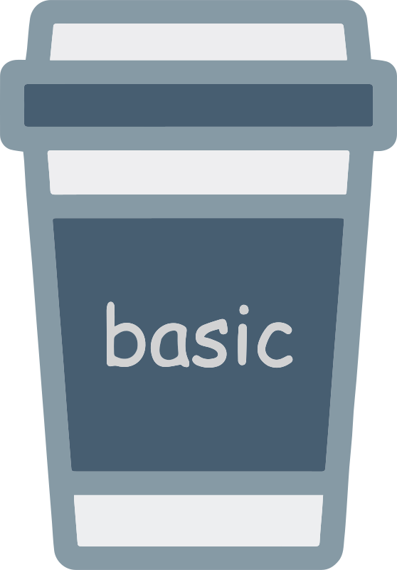

# Basic-Ads
 


[](https://central.sonatype.com/artifact/app.lexilabs.basic/basic-ads)
[](https://kotlinlang.org)

A Kotlin Multiplatform library to rapidly get Google AdMob running on Android and iOS


### How it works
Basic-Ads uses the existing Android and iOS [Google AdMob](https://admob.google.com/) libraries to display ads as `Composables`.
A [full walkthrough](https://medium.com/@robert.jamison/composable-ads-f8795924aa0d) is available on Medium,
and there's also [an easy-start template](https://github.com/LexiLabs-App/Example-Basic-Ads).

In case you need it, here's the [Basic-Ads API Documentation](https://ads.basic.lexilabs.app)

## Preparation
For **Android**, complete the steps in AdMob's instructions:

* [Configure your app](https://developers.google.com/admob/android/quick-start#import_the_mobile_ads_sdk)

For **iOS**, complete the steps in AdMob's instructions:

* [Import the Mobile Ads SDK](https://developers.google.com/admob/ios/quick-start#import_the_mobile_ads_sdk)

* [For GDPR Compliance Only] [Import the User Messaging Platform SDK](https://developers.google.com/admob/ios/privacy)

* [Update your Info.plist](https://developers.google.com/admob/ios/quick-start#update_your_infoplist)

> [!NOTE] 
> For Xcode 13+, you can update your [Custom iOS Target Properties](https://useyourloaf.com/blog/xcode-13-missing-info.plist/).

## Installation
* [](https://central.sonatype.com/artifact/app.lexilabs.basic/basic-ads)
[](https://kotlinlang.org)

* [](https://central.sonatype.com/artifact/app.lexilabs.basic/basic-ads)
[](https://kotlinlang.org)

> [!IMPORTANT] 
> Don't forget to [check the list of transitive dependencies and versions](VERSIONS.md) to ensure compatibility.

Add your dependencies from Maven
```toml
# in your 'libs.versions.toml' file
[versions]
kotlin = "+" # gets the latest version
compose = "+" # gets the latest version
basic = "+" # gets the latest version
google-play-services-ads = "+" # you did this during the preparation step
android-ump = "+" # you did this during the preparation step

[libraries]
basic-ads = { module = "app.lexilabs.basic:basic-ads", version.ref = "basic"}
google-play-services-ads = { module = "com.google.android.gms:play-services-ads", version.ref = "google-play-services-ads"}
android-ump = { module = "com.google.android.ump:user-messaging-platform", version.ref = "android-ump" }

[plugins] # make sure you're using the JetBrains plugin to import your composables
jetbrainsCompose = { id = "org.jetbrains.compose", version.ref = "compose" }
compose-compiler = { id = "org.jetbrains.kotlin.plugin.compose", version.ref = "kotlin" }
```

then include the library in your gradle build
```kotlin
// in your 'composeApp/build.gradle.kts' file
plugins {
    alias(libs.plugins.jetbrainsCompose)
    alias(libs.plugins.compose.compiler)
}

sourceSets {
    commonMain.dependencies {
        implementation(compose.runtime)
        implementation(compose.foundation)
        implementation(compose.material)
        implementation(compose.ui)
        implementation(libs.lexilabs.basic.ads)
    }
    androidMain.dependencies {
        implementation(libs.google.play.services.ads)
        implementation(libs.android.ump)
    }
}
```

## Initialization
Call `BasicAds.initialize` in your `commonMain` before building ads.

> [!NOTE] 
> You only need to initialize `Basic-Ads` in your `commonMain`. You do not need to initialize within each platform. 

```kotlin
// in your 'composeApp/src/commonMain/App.kt' file
@OptIn(DependsOnGoogleMobileAds::class)
@Composable
fun App() {
    // You'll need to access your platform-specific context (Android) or null (iOS) to pass as an `Any?` argument
    BasicAds.initialize(activity)
}
```

## Composing a `BannerAd`
You can build a `BannerAd` via a `Composable` function:
```kotlin
// in your 'composeApp/src/commonMain/AdScreen.kt' file
@Composable
fun AdScreen() {
    BannerAd() // Results in a Test Banner Ad being created
}
```

If you want to preload your `BannerAds`, there's a way to do that too:
```kotlin
// Load the Ad within your Composable
val bannerAd by rememberBannerAd(activity)
// Display the Ad as soon as it's available
BannerAd(bannerAd)
```
You can also check the `AdState` before doing something:
```kotlin
// Load the Ad within your Composable
val bannerAd by rememberBannerAd(activity)
// Determine to show or hide the Ad
var showBannerAd by remember { mutableStateOf(false) }
// Composable Button with callbacks
Button(
    onClick = { showBannerAd = true }, // Shows the ad on click
    /** Checks AdState and disables the button if ad isn't ready **/
    enabled = bannerAd.state == AdState.READY
) { Text("Show Banner Ad") } // label for the button
// Checks for button click
if (showBannerAd){
    // Shows Composable Ad
    BannerAd(bannerAd)
}
```

## Creating Full Screen Ads
You can also build other Ad types, but you'll need to [pass your Android `Activity` `Context` when you initialize](https://blog.hakz.com/contain-your-apps-memory-please-0c62819f8d7f).

```kotlin
// in your 'composeApp/src/commonMain/AdScreen.kt' file
// You'll need to access your platform-specific Activity (Android) or null (iOS) to pass as an `Any?` argument
InterstitialAd(activity)
RewardedAd(activity, onRewardEarned = {/** do something here **/})
RewardedInterstitialAd(activity, onRewardEarned = {/** do something here **/}) // currently a Google Beta feature
```
If you want to preload your ads, there's a way to do that too:
```kotlin
// Load the Ad within your Composable
val rewardedAd by rememberRewardedAd(activity)
// Display the Ad as soon as it's available
RewardedAd(
    ad = rewardedAd,
    onRewardEarned = { rewardItem ->
        /** do something here with the rewardItem (if it exists) **/
    }
)
```
You can also check the `AdState` before doing something:
```kotlin
// Load the Ad within your Composable
val interstitialAd by rememberInterstitialAd(activity)
// Determine to show or hide the Ad
var showInterstitialAd by remember { mutableStateOf(false) }
// Composable Button with callbacks
Button(
    onClick = { showInterstitialAd = true }, // Shows the ad on click
    /** Checks AdState and disables the button if ad isn't ready **/
    enabled = interstitialAd.state == AdState.READY
) { Text("Show Interstitial Ad") } // label for the button
// Checks for button click
if (showInterstitialAd){
    // Shows Composable Ad
    InterstitialAd(interstitialAd)
}
```

## Consent Requests

> [!TIP] 
> Consent Popups are typically only required for Californian or International audiences.
> GDPR is a _very_ in-depth topic, so please begin by reading about [what GDPR is](https://gdpr.eu/) 
> and [how AdMob complies with GDPR requirements](https://support.google.com/admob/answer/7666366?hl=en).

You can use the `Consent` features of Basic Ads with Composables too:
```kotlin
// in your 'composeApp/src/commonMain/AdScreen.kt' file
// You'll need to access your platform-specific Activity (Android) or null (iOS) to pass as an `Any?` argument
val consent by rememberConsent(activity)

// Create a ConsentPopup (if available in your region)
ConsentPopup(consent)

// Check if the user can see ads
if (consent.canRequestAds) {
    // Call your ads here
    InterstitialAd()
}
```

### Building this Garbage

> [!CAUTION] 
> Advanced Users Only

1. Find a large cup. It must exist in the real world.
2. Fill said cup to the brim with some sort of caffeinated beverage.
3. Click `File` > `Invalidate Caches...`, check all boxes and hit `invalidate and restart`
4. Click `Sync` for gradle if banner exists. Ignore the flood of warning lights and klaxons.
5. Click `Build` > `Clean Cache`.  Ignore the plethora of errors
6. Once complete, click `Build` > `Rebuild Project`. NOTE: Despite religious preference, prayer is encouraged.

### Known Issues:
* [Doesn't support Native Ads (yet)](https://github.com/LexiLabs-App/basic-ads/issues/29)
* Version 0.2.7-beta01 breaks most of the API. Just don't use it
